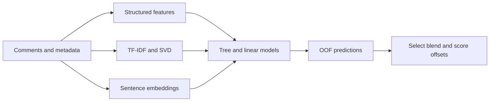

# Comment moderation — representation and ensemble experiments

Four-class NLP classification with imbalanced labels, structured metadata, TF-IDF/SVD, sentence embeddings, gradient boosting, and a linear text model.

[Recorded V4 notebook](23f1001015-notebook-v4.ipynb) · [V4 script](v4_solution.py) · [V5 experiment](v5_solution.py) · [Problem statement](PROBLEM_STATEMENT.md)

## Recorded results, with limits

The table transcribes saved outputs from the [V4 notebook at commit 3ee35e8](https://github.com/jbanmol/comment-moderation-nlp-ensemble/blob/3ee35e85d2743532da3927989b3c73cdc1f4bfbe/23f1001015-notebook-v4.ipynb), evaluated over **198,000 labeled rows**. These are recorded exploratory out-of-fold (OOF) scores, not a new reproduction or an independent test benchmark.

| Model / selection stage | Recorded macro-F1 |
|---|---:|
| Logistic regression (text) | 0.60453 |
| CatBoost | 0.77132 |
| LightGBM | 0.79170 |
| XGBoost | 0.79945 |
| Selected weighted ensemble | 0.80659 |
| Ensemble + selected class-score offsets | 0.80701 |

**Interpretation matters:** TF-IDF, SVD, and scaling are fitted before the five-fold cross-validation loop. Ensemble weights and class-score offsets are selected against the same OOF labels used to report their scores. This introduces validation information into preprocessing and selection, so the results are not an unbiased estimate of generalization. The class-score adjustment adds offsets before argmax; it is not calibrated probability estimation.

The notebook also prints a historical V3 leaderboard number, but no official leaderboard record was verified for this README. No public-test result is claimed here.

## Approach

The saved notebook includes per-class precision/recall/F1 and a confusion matrix. Inspect minority-class behavior rather than using overall accuracy as the sole criterion.

## Reproduction status

The scripts expect competition files under `/kaggle/input/comment-category-prediction-challenge/`: `train.csv`, `test.csv`, and `Sample.csv`. Dataset access and an exact tested dependency environment are not bundled. Optional XGBoost, CatBoost, and sentence-transformer imports can change which models participate.

Use the V4 notebook to inspect the recorded run. To reproduce training, obtain permitted dataset access, preserve package/model versions, and record which optional components are enabled. The saved outputs alone do not prove that a fresh environment reproduces the result.

## Next evaluation requirements

Fit learned preprocessing inside each training fold; separate ensemble/offset selection from final evaluation; assess grouping by repeated posts/authors and possible train-test shift; and publish fold assignments, out-of-fold predictions, environment versions, and an untouched test result. Keep V4 and V5 results separately identified.
